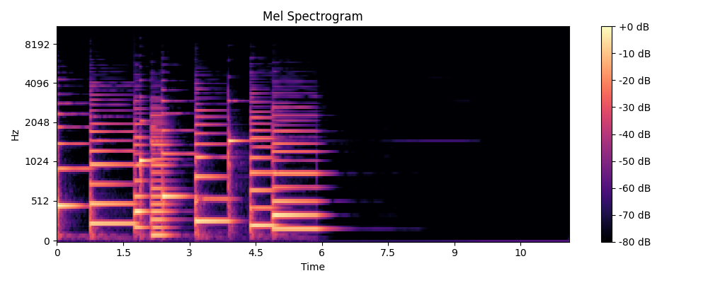
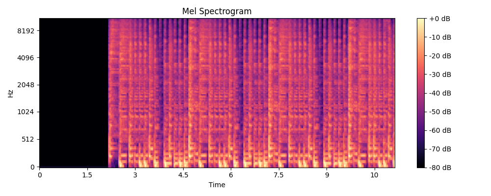
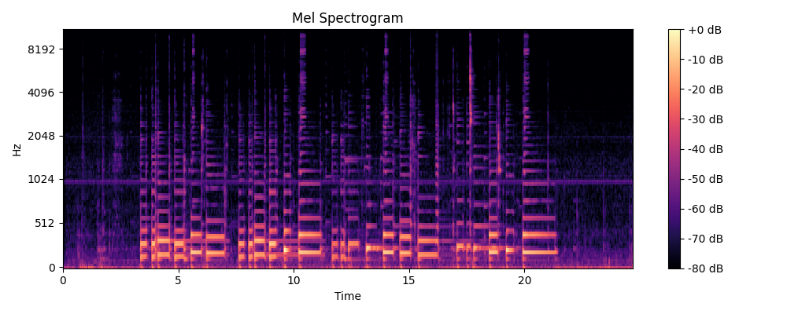
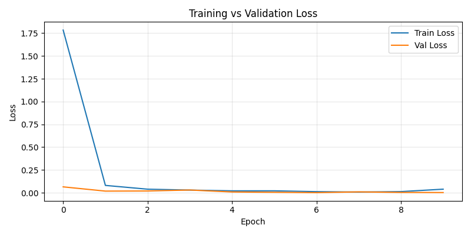
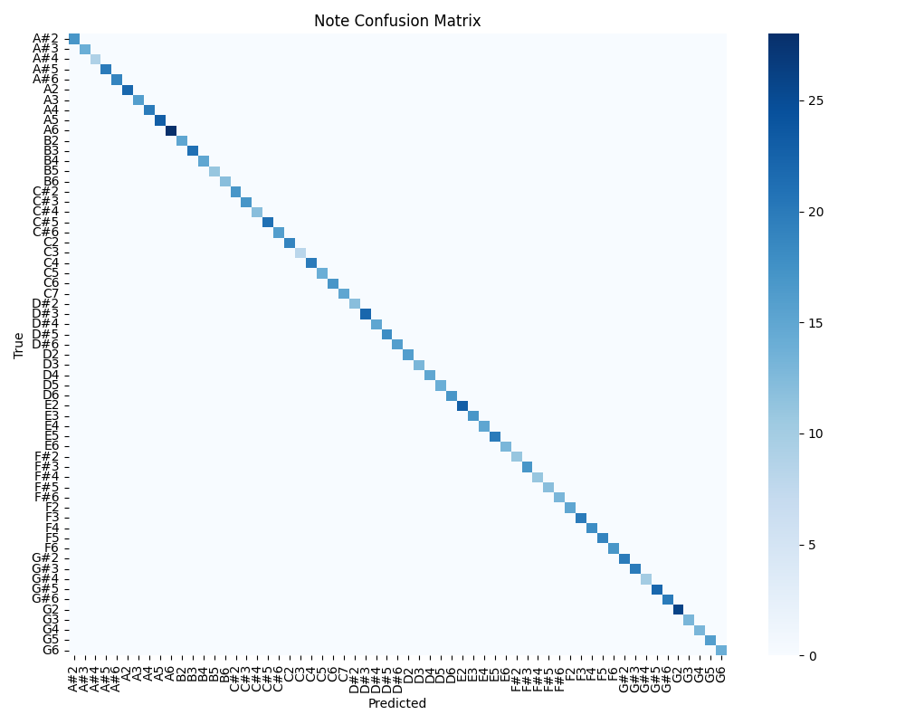
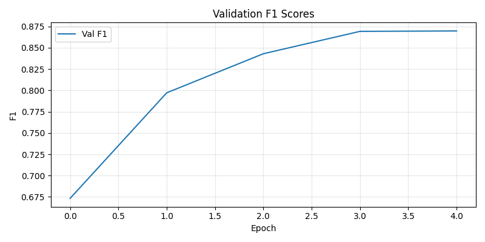
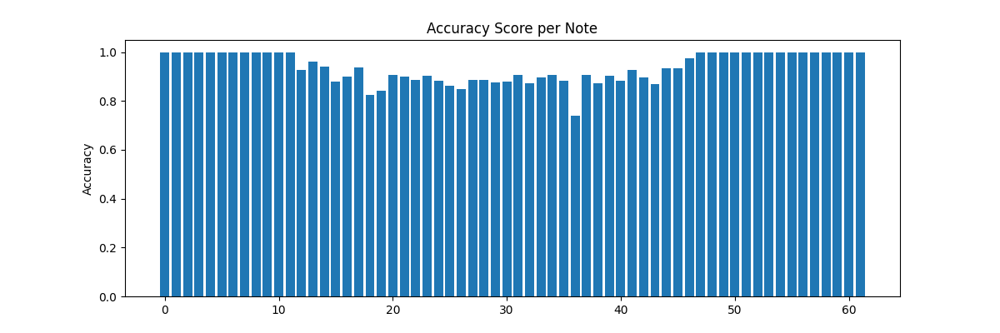

# Music Note Generator
Members: Melvin Cheng, Megan Lai, Harsh Nigam

## Project Overview
We built a sheet music generator that will classify the notes and rhythms of a spectogram given an audio (.wav) file. Our product will then generate the MIDI file allowing the user to read and play along with the sound they heard.  

By building a CNN and exploring the architectures, we were able to get a high accuracy to detect singular notes. 

<!-- ## Existing Solutions -->


<!-- ## Methodology -->

## Our Data
We generate our data by using the music21 to generate MIDI files consisting of random notes or chords. We then convert the MIDI files to WAV files such that we can use the librosa library to extract the CQT spectograms, which contain the numerical features of our notes. 

An visualization of our data is shown in the generated spectograms below.



This spectogram was created from one of the MIDI files in the [lakh](https://www.kaggle.com/datasets/imsparsh/lakh-midi-clean) dataset, depicting multiple voices.


The above spectogram was created from an audio file we created by playing happy birthday on the guitar.


## Setup
```bash
pip install pretty_midi music21 librosa

# Install fluidsynth
choco install fluidsynth # for windows
```

## How to use:

#### Data Files:
[`create_music.py`](create_music.py) - Generates the MIDI files of randomly generated notes  
[`data_processing.py`](data_processing.py) - Generates the WAV files and CQT features which can be passed as input to our model  
[`multilabel/generate_chords.py`](multilabel/generate_chords.py) - Generates the MIDI files of randomly generated chords for multilabel classification  
[`data_processing_chords.py`](data_processing_chords.py) - Generates the WAV files and CQT features for our chords dataset which can be passed as input to our multilabel model    

<!-- [`multilabel/data_processing_lakh.py`](multilabel/data_processing_lakh.py) - Gets data from the lakh dataset (not used in final) -->

[`dataset.py`](dataset.py) & [`multilabel/multilabel_dataset.py`](multilabel/multilabel_dataset.py) - Contains the data pipelines to create and save the dataloaders for model training

#### Models &  Training and Evaluation
[`note_cnn.py`](note_cnn.py) contains the definition for the `CNN` for a note classifier.  
[`rhythm_cnn.py`](rhythm_cnn.py) contains the definition for the rhythm classifier.  
[`multilabel/multilabel_model.py`](multilabel/multilabel_model.py) contains the definition for the multilabel note classifier.  
  
[`train.py`](train.py) training for the note classifier  
[`multilabel/multilabel_train.py`](multilabel/multilabel_train.py) training for multilabel note classifier  

[`evaluation.py`](evaluation.py) evaluation for predicting the notes and rhythms of the test dataset  
[`multilabel/multilabel_eval.py`](multilabel/multilabel_eval.py) evaluation for predicting chords  


#### Predictions of Live Recordings
[`generate_sheet_music.py`](generate_sheet_music.py) - Contains pipeline to generate the spectogram/inputs to the prediction model from a given WAV file, and creates a `*.mid` and `*.musicxml` sheet music files which can be opened in MuseScore. The results are found in the [`predictions_midi`](predictions_midi) folder.  

To train the models, run the following:
```bash
python3 note_cnn.py # train the note classifier and save the model
python3 rhythm_cnn.py # train the rhythm classifier and save the model
python3 multilabel/multilabel_train.py # trains multilabel model and save the model

python3 generate_sheet_music.py # fill in the parameters in the files to generate the sheet music for a new WAV file
```

By default, the trained models gets saved to `note_classifier.pth` and `rhythm_classifier.pth`.

## Results & Evaluation

### Note Classifier:
On training the note classifier, we get the following training loss over 10 epochs:


As we can see in the graph, the loss is steep in the first epoch, therefore the model learns the patterns in the spectograms quickly. 

To ensure the model is not overfitting the data, we also validate the data during training. As shown in the graph above, the validation loss is low throughout training epochs. The validation accuracy is depicted below. We can then see that the accuracy reaches 0.999 in the final training epoch.


To further evaluate this on the test dataset, we can create a confusion matrix of the accuracy per note class.



### Multilabel Note Classifier:
On training the Multilabel note classifier, we get the following evaluation results:  
Hamming Accuracy: 0.7553	Precision: 0.9007     Recall: 0.8435			F1 Score: 0.8712  
  
  
We improved the evaluation by weighing the true positives of the data such that it focuses on identifying notes that are present in the note segment than notes not present. We get the following evaluation results:
Hamming Accuracy: 0.9392796959900956 Precision: 0.5469815135002136, Recall: 0.8738868832588196, F1: 0.6728278994560242

The following graph demonstrates the f1 score over the training epochs.


We get the following per note accuracy:  



## Resources

### Spectogram
https://medium.com/analytics-vidhya/understanding-the-mel-spectrogram-fca2afa2ce53

### PyTorch
https://docs.pytorch.org/tutorials/beginner/blitz/cifar10_tutorial.html
https://docs.pytorch.org/docs/stable/generated/torch.nn.Conv2d.html#torch.nn.Conv2d
